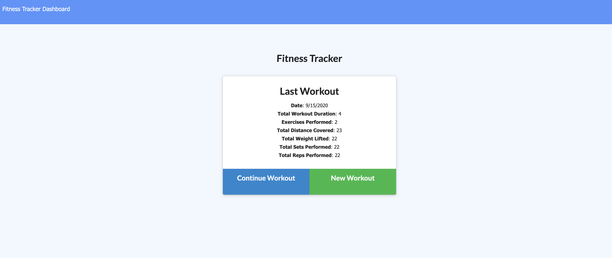

# workoutTracker

Link to deployed website : https://frozen-tor-52478.herokuapp.com/?id=5f5a85f199eb7200177b8652

# Description

This app allows the user to track their fitness regiments and keep track of their past workouts.  Upon opening the app, the user will have the option to either start a new workout, or continue an existing workout if the site has been previously visited and used by the user.  They will they choose from the dropdown menu wheither the workout is a resistance workout, or a cardio workout.  Once the type of workout is selected, enter the desired attributes for exercise name, weight, sets, reps, duration, (or distance if cardio). Once the workout is completed, click Add Exercise to add the exercise to your compiled list of completed exercises.  There, you can see the totals for all the workouts you have done. Have a great workout!

